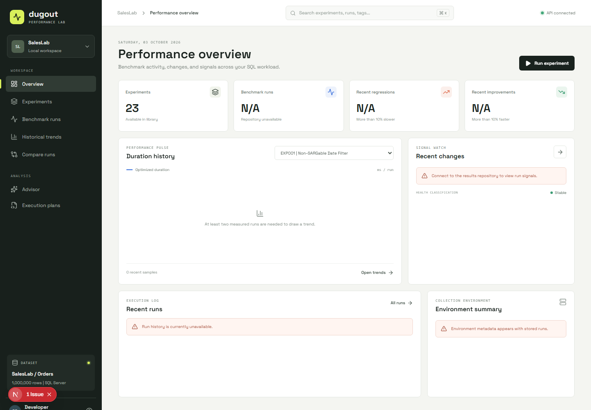

# Dugout

Dugout is a benchmark runner focused on SQL Server performance experiments. The project is being built in line with the Phase 1 requirements in the repo docs, with emphasis on repeatable, observable, and trustworthy benchmark execution.

## Purpose

The current milestone establishes the benchmark engine foundation for:

- loading and validating experiment definitions
- preparing a known database state
- running warmup and measured SQL executions
- capturing raw timing data and row counts
- validating equivalence between baseline and optimized queries
- calculating summary statistics and improvement percentages
- persisting benchmark output for later analysis

## Current Status

The repository now includes the benchmark engine, SQL diagnostics, execution-plan analysis, and a SQL Server-backed historical results repository, including:

- a .NET solution with runner, contracts, storage, and tests
- a CLI runner with experiment listing/filtering, benchmark execution, history, comparison, and resource reports
- baseline establishment, historical trend reporting, and configurable regression detection
- evidence-based advisor findings and recommendations on successful benchmark runs
- a Minimal API exposing experiments, runs, history, comparisons, advisor analysis, and plans
- a responsive Next.js workspace for benchmark exploration, history, comparisons, advisor findings, and plans
- a Next.js dashboard for experiments, benchmark history, comparisons, advisor findings, and plans
- experiment validation and statistical calculation logic
- a sample `EXP001` benchmark definition
- local SQL Server docker setup for a benchmark dataset
- SQL Server IO/TIME diagnostics captured for every measured query iteration
- schema-v4 resource metrics, execution plans, and history stored in `DugoutResults`

## Solution Structure

```text
src/
   Dugout.Api/
  Dugout.Runner/
  Dugout.Contracts/
  Dugout.Storage/

web/
   Next.js dashboard

tests/
  Dugout.Runner.Tests/

experiments/
  EXP001/

docker/
  docker-compose.yml
  seed-saleslab.sql

docs/
  ARCHITECTURE_PRINCIPLES.md
  P1_MILESTONE_01_REVISED.md
  P*_
  ...
```

## Prerequisites

- Docker Desktop running (Linux containers), with at least 4 GB of memory available to Docker
- .NET 10 SDK (`dotnet --version` shows 10.x)
- PowerShell, opened in the repository root (for example `cd C:\Projects\dugout`)
- Port 1433 free. If a local SQL Server instance is using it, stop that instance first.

## Run Locally

1. Start SQL Server and wait until it reports healthy:

```powershell
   docker compose -f docker/docker-compose.yml up -d --wait
```

2. Seed the database (creates `SalesLab` and 1,000,000 rows in `dbo.Orders`):

```powershell
   docker cp .\docker\seed-saleslab.sql dugout-sqlserver:/tmp/seed-saleslab.sql
   docker exec dugout-sqlserver /opt/mssql-tools18/bin/sqlcmd -S localhost -U sa -P 'YourStrong!Passw0rd' -C -i /tmp/seed-saleslab.sql
```

   Success looks like `(1000000 rows affected)` with no lines starting with `Msg`.

3. Set the connection string for this PowerShell session (repeat in any new window):

```powershell
   $env:DUGOUT_CONNECTION = 'Server=localhost,1433;Database=SalesLab;User Id=sa;Password=YourStrong!Passw0rd;Encrypt=False;TrustServerCertificate=True;'
```

4. List experiments:

```powershell
   dotnet run -c Release --project src/Dugout.Runner -- list
```

5. Run the sample benchmark, then show its exit code:

```powershell
   dotnet run -c Release --project src/Dugout.Runner -- run EXP001
   $LASTEXITCODE
```

   Results are written to `results\EXP0xx\<runId>.json` and stored in the `DugoutResults` database on the same SQL Server instance. The runner creates the database and tables when needed; the SQL login needs permission to create a database the first time it runs.

To change the default 3 warmups and 10 measured iterations, pass either or both options:

```powershell
dotnet run -c Release --project src/Dugout.Runner -- run EXP001 --warmups 5 --iterations 25
```

Exit codes: 0 = success, 1 = invalid input or experiment definition, 2 = baseline/optimized results differ, 3 = execution failure.

## SQL Diagnostics

Measured iterations enable `SET STATISTICS IO ON` and `SET STATISTICS TIME ON`. Dugout stores the raw SQL Server metrics alongside duration and rows returned:

- Logical reads, physical reads, and scan count
- SQL CPU time and SQL elapsed time, in milliseconds
- Min, max, average, median, and standard deviation for each metric

The console summary compares median values and reports improvements for duration, logical reads, CPU time, and SQL elapsed time. A typical diagnostic section looks like:

```text
Diagnostic Summary (median)
Metric                 Baseline   Optimized   Improvement
Logical Reads            15,742       1,225         92.2%
Physical Reads                0           0           n/a
Scan Count                    1           1           n/a
CPU Time (ms)               189          48         74.6%
SQL Elapsed (ms)            248          76         69.4%
```

Schema version 2 introduced SQL diagnostic fields; version 3 added execution plans. Current result files use schema version 4 and retain all prior data alongside advanced resource metrics. A measured iteration still contains raw values, for example:

```json
{
   "schemaVersion": 4,
   "baseline": {
      "runs": [
         {
            "durationMs": 248.1,
            "rowsReturned": 1,
            "logicalReads": 15742,
            "physicalReads": 0,
            "scanCount": 1,
            "cpuTimeMs": 189,
            "sqlElapsedTimeMs": 248,
            "requestedMemoryKb": 0,
            "grantedMemoryKb": 0,
            "usedMemoryKb": 0,
            "tempDbPages": 0,
            "tempDbAllocatedPages": 0,
            "worktableLogicalReads": 0,
            "degreeOfParallelism": 1,
            "usedParallelPlan": false,
            "parallelOperators": 0
         }
      ]
   },
   "baselinePlan": {
      "planHash": "A1B2...",
      "planXml": "<ShowPlanXML />",
      "estimatedCost": 4.25,
      "estimatedRows": 100,
      "estimatedSubtreeCost": 4.25,
      "operators": {
         "Clustered Index Scan": 1
      },
      "operatorOccurrences": []
   },
   "optimizedPlan": {
      "planHash": "C3D4...",
      "planXml": "<ShowPlanXML />",
      "estimatedCost": 0.12,
      "estimatedRows": 100,
      "estimatedSubtreeCost": 0.12,
      "operators": {
         "Index Seek": 1
      },
      "operatorOccurrences": []
   },
   "planComparison": {
      "planHashesMatch": false,
      "operatorChanges": [
         { "physicalOperator": "Clustered Index Scan", "baselineCount": 1, "optimizedCount": 0 },
         { "physicalOperator": "Index Seek", "baselineCount": 0, "optimizedCount": 1 }
      ]
   }
}
```

Plan hashes are SHA-256 hashes of SQL Server's `QueryPlanHash` when present, falling back to normalized plan XML when unavailable. This avoids treating compile-time metadata changes as plan changes. Raw XML is retained in each plan artifact. Version 1 and 2 result files remain loadable; fields introduced by later versions are absent when reading older files.

## ** Milestone 01 Acceptance Test

Follow these steps in order, in one PowerShell window. Avoid other heavy work on the machine while benchmarks run.

**A. Unit tests**

```powershell
dotnet test Dugout.slnx --nologo
```

Expected: all tests pass.

**B. Fresh environment** (deletes any existing data)

```powershell
docker compose -f docker/docker-compose.yml down -v
docker compose -f docker/docker-compose.yml up -d --wait
docker cp .\docker\seed-saleslab.sql dugout-sqlserver:/tmp/seed-saleslab.sql
docker exec dugout-sqlserver /opt/mssql-tools18/bin/sqlcmd -S localhost -U sa -P 'YourStrong!Passw0rd' -C -i /tmp/seed-saleslab.sql
$env:DUGOUT_CONNECTION = 'Server=localhost,1433;Database=SalesLab;User Id=sa;Password=YourStrong!Passw0rd;Encrypt=False;TrustServerCertificate=True;'
```

Expected: `(1000000 rows affected)`, no `Msg` lines.

**C. Repeatability: three consecutive runs**

Run this block three times in a row:

```powershell
dotnet run -c Release --project src/Dugout.Runner -- run EXP001
$LASTEXITCODE
```

Expected each time: exit code `0`, `Validation: Passed`, and a new file in `results\EXP001\`.

**D. Failure check 1: database unavailable**

```powershell
docker stop dugout-sqlserver
dotnet run -c Release --project src/Dugout.Runner -- run EXP001
$LASTEXITCODE
docker compose -f docker/docker-compose.yml up -d --wait
```

Expected: exit code `3`, summary shows `Failure stage: Opening Connection`, and a result file is still written.

**E. Failure check 2: results differ**

1. Open `experiments\EXP001\scripts\exp001\optimized.sql` and change `'2026-01-01'` to `'2025-12-01'`. Save.
2. Run:

```powershell
   dotnet run -c Release --project src/Dugout.Runner -- run EXP001
   $LASTEXITCODE
```

   Expected: exit code `2`, `Failure stage: Validating Results`, and no measured runs in the result file.
3. Change `'2025-12-01'` back to `'2026-01-01'`. Save.
4. Run once more:

```powershell
   dotnet run -c Release --project src/Dugout.Runner -- run EXP001
   $LASTEXITCODE
```

   Expected: exit code `0`, and `experimentHash` in this result file matches the hash in the step C files (confirms the file was restored exactly).

**F. Collect results**

All result files are in `results\EXP001\`. There should be six: three from C, one from D, two from E.

## ** Milestone 02 Acceptance Test

Milestone 02 keeps the Milestone 01 benchmark and validation workflow. Run the M01 acceptance checks above when you want to recheck repeatability and failure handling; M02 adds metric-collection and result-schema checks. M02 originally wrote schema version 2; the current M03 runner writes version 3 while retaining all M02 fields. A schema version by itself is not a passing benchmark.

**A. Unit tests**

```powershell
dotnet test Dugout.slnx --nologo
```

Expected: all tests pass, including SQL IO/TIME parsing, metric aggregation, schema-v4 serialization, and schema-v1/v2/v3 loading.

**B. Prepare the database**

Use Run Locally steps 1-3 above to start and seed SQL Server and set `DUGOUT_CONNECTION`. Do not run `docker compose down -v` unless you intend to delete and recreate the database volume. If the database is already healthy and seeded, keep using it.

**C. Run EXP001**

```powershell
dotnet run -c Release --project src/Dugout.Runner -- run EXP001
$LASTEXITCODE
```

Expected: exit code `0`, `Validation: Passed`, a diagnostic summary in the console, and a new result file under `results\EXP001\`.

**D. Check the result file**

Open the new result JSON and verify:

- `schemaVersion` is `4` in the current runner and `status` is `Success`.
- Both `baseline.runs` and `optimized.runs` contain the configured number of measured iterations.
- Every measured run contains `logicalReads`, `physicalReads`, `scanCount`, `cpuTimeMs`, and `sqlElapsedTimeMs`, in addition to duration and rows returned.
- Each variant has statistics for duration and all five SQL metrics, and `improvement` contains diagnostic comparisons where a baseline median is nonzero.
- EXP001 shows a meaningful diagnostic difference, especially lower logical reads; CPU and SQL elapsed medians should generally also be lower. Physical reads may be zero for both variants. Scan count is captured and compared, but can remain the same for this single-table experiment.

The run passes the M02 checks when tests pass and the successful benchmark has raw SQL metrics and diagnostic summaries. In the current runner those fields are persisted in schema version 4. M01's repeatability and failure checks remain useful regression checks, but are not additional M02-only steps.

## ** Milestone 03 Acceptance Test

M03 extends the same EXP001 workflow with estimated execution plans. It does not replace M01/M02 metric collection or result validation.

**A. Unit tests**

```powershell
dotnet test Dugout.slnx --nologo
```

Expected: all tests pass, including plan XML parsing, stable plan hashing, schema-v1/v2/v3 loading, and schema-v4 plan serialization.

**B. Prepare and run EXP001**

Use Run Locally steps 1-3 if SQL Server is not already running and seeded, then run:

```powershell
dotnet run -c Release --project src/Dugout.Runner -- run EXP001
$LASTEXITCODE
```

Expected: exit code `0`, validation passes, the existing diagnostic metrics appear, and the console prints each plan hash, available estimated cost/rows, operator counts, and observed operator-count changes.

A typical comparison looks like:

```text
Execution Plans
Baseline: <plan hash>
   Operators: Clustered Index Scan (1)
Optimized: <plan hash>
   Operators: Index Seek (1)
Plan hashes: differ
Observed operator count changes:
   Clustered Index Scan: 1 -> 0
   Index Seek: 0 -> 1
```

This reports the operators and counts present in each captured plan; it does not infer optimizer intent.

**C. Check the result file**

Open the new file under `results\EXP001\` and verify `schemaVersion` is `4`, `baselinePlan` and `optimizedPlan` include a hash, raw XML, and operator information, and `planComparison` contains only operator counts that differ. Plan metadata can be null when SQL Server does not provide it. For EXP001, expect an observable scan/seek operator difference; exact operators and costs can vary by SQL Server version and environment.

M03 passes when all tests pass and a successful EXP001 run persists both raw plans alongside the existing benchmark and SQL diagnostic data.

## Advanced Resource Metrics

During each measured query Dugout enables `SET STATISTICS XML ON` in addition to the existing IO/TIME collection. It parses the returned runtime plan for requested/granted/used memory, degree of parallelism, parallel-plan use, and parallel operator count. `STATISTICS IO` provides Worktable/Workfile logical reads. TempDB allocated and net page deltas are sampled around the query from `sys.dm_db_session_space_usage`; if the SQL login cannot read that DMV, those values are unavailable. A query that needs no memory grant or TempDB allocation can legitimately report zero.

These values are saved per iteration in schema-v4 JSON and in the P5 columns of `DugoutResults.dbo.BenchmarkMetrics`. Existing version-3 databases are upgraded in place when the repository initializes. `sampleCount` on metric statistics distinguishes a measured zero from an unavailable metric.

Inspect recent resource measurements, including top memory consumers, highest TempDB usage, and parallel-versus-serial executions:

```powershell
dotnet run -c Release --project src/Dugout.Runner -- resources EXP001 --latest 100
```

A successful EXP001 report can show a serial plan with no grant or TempDB work:

```text
Requested memory (KB)       n/a         n/a
Granted memory (KB)         0.0         0.0
Used memory (KB)            0.0         0.0
TempDB net pages            0.0         0.0
Worktable logical reads     0.0         0.0
Degree of parallelism       1.0         1.0
Parallel operators          0.0         0.0
Parallel plan         0/10      0/10
```

## ** Milestone 04 Acceptance Test

**A. Unit tests**

```powershell
dotnet test Dugout.slnx --nologo
```

Expected: all tests pass.

**B. Run and query a benchmark**

Use Run Locally steps 1-3 if SQL Server is not already running and seeded. Then run:

```powershell
dotnet run -c Release --project src/Dugout.Runner -- run EXP001
$LASTEXITCODE
dotnet run -c Release --project src/Dugout.Runner -- history EXP001 --latest 1
```

Expected: exit code `0`, validation passes, a result JSON is created, and the same run appears in repository history with environment and plan hashes.

**C. Compare historical runs**

Run EXP001 a second time, then pass the two run IDs printed in the JSON/result history to:

```powershell
dotnet run -c Release --project src/Dugout.Runner -- compare <run1> <run2>
```

Expected: baseline and optimized medians are compared, and plan hashes/operator-count changes are shown for both variants. Identical SQL Server plans should retain matching plan hashes across runs.

**D. Check repository rows**

Verify that the latest run has records in `BenchmarkRuns`, `BenchmarkMetrics`, `ExecutionPlans`, `Experiments`, `ExperimentVersions`, and `Environments`. JSON remains the export/archive copy; the repository is the queryable history store.

## ** Milestone 05 Acceptance Test

**A. Unit tests**

```powershell
dotnet test Dugout.slnx --nologo
```

Expected: all tests pass, including memory-grant and parallelism parsing, Worktable IO parsing, schema-v4 serialization, and v1/v2/v3 backward compatibility.

**B. Run EXP001 and inspect resource history**

Use Run Locally steps 1-3 if SQL Server is not already running and seeded, then run:

```powershell
dotnet run -c Release --project src/Dugout.Runner -- run EXP001
$LASTEXITCODE
dotnet run -c Release --project src/Dugout.Runner -- resources EXP001 --latest 50
```

Expected: the benchmark validates, writes schema-v4 JSON, persists all raw resource fields in the repository, and retains existing metrics and plans. Resource measurements that are unavailable are represented as null/`n/a`; zero is valid when a query used no grant or TempDB pages. EXP001 may be serial and use no TempDB, so its parallelism and TempDB values need not be nonzero.

**C. Check stored metrics**

Verify each new measured row in `BenchmarkMetrics` includes the P5 columns for memory grants, TempDB pages, worktable reads, DOP, parallel-plan use, and parallel operators. Existing v3 result files and repository rows remain readable; old JSON files are not rewritten.

M05 passes when tests pass, the successful run is persisted with schema-v4 extended metrics, and the resource-history command returns those measurements.

## ** Milestone 06 Acceptance Test

```powershell
dotnet test Dugout.slnx --nologo
dotnet run -c Release --project src/Dugout.Runner -- list
dotnet run -c Release --project src/Dugout.Runner -- list --category Indexing
dotnet run -c Release --project src/Dugout.Runner -- list --difficulty Advanced
dotnet run -c Release --project src/Dugout.Runner -- list --tag ParameterSniffing
dotnet run -c Release --project src/Dugout.Runner -- run EXP001
```

Expected: at least 20 definitions and guides are present, filters return only matches, metadata survives repository persistence, and EXP001 plus historical reporting remain functional.

## Results Repository

Each benchmark run is written to both the JSON archive and the SQL Server database `DugoutResults`. Repository tables are initialized automatically on `dugout run`; the SQL login must be allowed to create a database on first use. The repository database is created on the server in `DUGOUT_CONNECTION`, unless an alternate connection is supplied:

```powershell
$env:DUGOUT_RESULTS_CONNECTION = 'Server=localhost,1433;Database=DugoutResults;User Id=sa;Password=YourStrong!Passw0rd;Encrypt=False;TrustServerCertificate=True;'
```
$env:DUGOUT_CONNECTION = 'Server=localhost,1433;Database=SalesLab;User Id=sa;Password=YourStrong!Passw0rd;Encrypt=False;TrustServerCertificate=True;'

When `DUGOUT_RESULTS_CONNECTION` is unset, Dugout derives it from `DUGOUT_CONNECTION` and changes the database name to `DugoutResults`.

The database schema is:

| Table | Stored data |
| --- | --- |
| `Experiments` | Experiment ID, name, description, category, difficulty, tags, learning objectives, and current definition hash |
| `ExperimentVersions` | One immutable definition snapshot per experiment hash |
| `Environments` | SQL Server version/edition, .NET and runner versions, and machine name |
| `BenchmarkRuns` | Run status, timestamps, environment, summary medians, and full result JSON |
| `BenchmarkMetrics` | Raw duration, row count, IO, CPU, and elapsed metrics per measured iteration and variant |
| `ExecutionPlans` | Plan hash, estimated metadata, operator JSON, and raw plan XML per variant |

Inspect recent runs for an experiment:

```powershell
dotnet run -c Release --project src/Dugout.Runner -- history EXP001 --latest 10
```

`--latest` defaults to 20. Filter by a SQL Server version prefix or machine name:

```powershell
dotnet run -c Release --project src/Dugout.Runner -- history EXP001 --sql-version 'Microsoft SQL Server 2022' --environment $env:COMPUTERNAME
```

Use `--latest 1` for the latest benchmark. Compare two stored run IDs to see median metric changes and historical plan/operator changes:

```powershell
dotnet run -c Release --project src/Dugout.Runner -- compare <run1> <run2>
Example:
dotnet run -c Release --project src/Dugout.Runner -- compare a5e4a8403f8c 2653726b3c8d
```

The comparison reports positive percentages when the second run improves over the first and negative percentages for regressions. Plan hashes and operator counts are compared independently for baseline and optimized variants.

Existing result JSON files remain readable and unchanged. They are not automatically imported into `DugoutResults`; only runs performed after repository storage is enabled appear in database history.

## ** Milestone 07: Regression Detection and Trends

Establish or replace an experiment's performance baseline from its most recent successful run:

```powershell
dotnet run -c Release --project src/Dugout.Runner -- baseline EXP001
```

Compare the latest successful run to the most recently established baseline, or target an experiment explicitly:

```powershell
dotnet run -c Release --project src/Dugout.Runner -- compare baseline latest
dotnet run -c Release --project src/Dugout.Runner -- compare baseline latest EXP001
```

Explicit run-to-run comparisons remain available with `compare <run1> <run2>`. Every comparison reports duration, logical reads, CPU, and SQL elapsed time, classifies regressions, and is stored in `DugoutResults.dbo.BenchmarkComparisons`.

Default regression thresholds are greater than 10% (Minor), 25% (Moderate), and 50% (Severe). Minor maps to Warning; Moderate and Severe map to Regression. Thresholds can be overridden on `compare` and `history`:

```powershell
dotnet run -c Release --project src/Dugout.Runner -- compare baseline latest EXP001 --minor-threshold 8 --moderate-threshold 20 --severe-threshold 40
```

`history EXP001` reports trends for optimized duration, logical reads, CPU, and elapsed-time medians. It compares the earliest and latest available successful samples in the selected history window: changes above the minor threshold are Increasing, changes below its negative are Decreasing, and changes within that band are Stable. Failed runs and unavailable metrics are excluded; at least two samples are needed for a trend. A baseline is stored per experiment in `DugoutResults.dbo.BenchmarkBaselines`; the shorthand `compare baseline latest` uses the most recently established baseline when no experiment ID is supplied.

## ** Milestone 08: Advisor Engine

Every successful `run` evaluates benchmark metrics, execution plans, and available successful-run history. Findings include the rule that fired, a short conclusion, supporting evidence, and severity. Recommendations include their rule and a deterministic confidence score. Analysis is included in the run JSON and persisted transactionally with the benchmark in `DugoutResults.dbo.AdvisorFindings` and `DugoutResults.dbo.AdvisorRecommendations`.

The initial rules are deterministic:

- Access path optimization: logical reads improve by more than 50%, duration improves by more than 30%, and a scan operator is replaced by a seek.
- Regression: optimized duration increases by more than 25% compared with the previous successful run for the experiment.
- Plan change: the optimized plan hash changes while optimized duration increases compared with the previous successful run.
- Resource reduction: both CPU time and logical reads improve between the baseline and optimized query.
- Historical trend: a metric's earliest-to-latest available successful-run value increases by more than the minor trend threshold (10%).

When evidence is missing, the corresponding rule does not fire. Advisor output appears in the normal benchmark summary under **Advisor Findings** and **Advisor Recommendations**. To inspect a saved report, read `advisorFindings` and `advisorRecommendations` in the schema-v4 result JSON.

## ** Milestone 09: Public API

Run the API from the repository root. Set `DUGOUT_CONNECTION` to the `SalesLab` benchmark database; it is used to execute POSTed benchmarks and, by default, derives the `DugoutResults` repository connection. Set `DUGOUT_RESULTS_CONNECTION` separately when the repository uses another server or login.

```powershell
$env:DUGOUT_CONNECTION = 'Server=localhost,1433;Database=SalesLab;User Id=sa;Password=YourStrong!Passw0rd;Encrypt=False;TrustServerCertificate=True;'
$env:DUGOUT_RESULTS_CONNECTION = 'Server=localhost,1433;Database=DugoutResults;User Id=sa;Password=YourStrong!Passw0rd;Encrypt=False;TrustServerCertificate=True;'
dotnet run --project src/Dugout.Api --urls http://localhost:5080
```

Experiment listing and details are available without a SQL connection. Run, history, baseline, comparison, plan, and run-detail routes use `DugoutResults`; the SQL login must be permitted to create that database the first time the API initializes it. The API has no authentication or authorization in this milestone and should only be exposed on a trusted local network.

The generated OpenAPI document is available at [http://localhost:5080/openapi/v1.json](http://localhost:5080/openapi/v1.json). The project exposes the OpenAPI JSON document directly; there is no separate Swagger UI. A request-by-request harness is in [Dugout.Api.http](src/Dugout.Api/Dugout.Api.http).

| Method | Endpoint | Purpose |
| --- | --- | --- |
| GET | `/api/experiments` | List experiment definitions |
| GET | `/api/experiments/{id}` | Get experiment metadata |
| POST | `/api/experiments/{id}/run` | Execute an experiment; accepts `warmupRuns` and `measuredRuns`, returns `201` and the run location |
| GET | `/api/runs?latest=20` | List recent runs; `latest` defaults to 20 |
| GET | `/api/runs/{id}` | Get run metrics, validation, and advisor output |
| GET | `/api/history/{experimentId}?latest=20` | Get experiment history; `latest` defaults to 20 |
| GET | `/api/baseline/{experimentId}` | Get the stored performance baseline |
| GET | `/api/compare/{runA}/{runB}` | Compare metrics and execution plans |
| GET | `/api/runs/{id}/analysis` | Get advisor findings and recommendations |
| GET | `/api/runs/{id}/plans` | Get parsed plans and raw Showplan XML |

## ** Milestone 10: Web Platform

Run the API in one PowerShell window after setting `DUGOUT_CONNECTION` as described above:

```powershell
dotnet run --project src/Dugout.Api --urls http://localhost:5080
```

In a second window from the repository root, start the Next.js dashboard:

```powershell
Push-Location web
npm ci
npm run dev
```

The web development script uses Webpack because the installed Next.js Turbopack
PostCSS resolver fails to load its internal `@vercel/turbopack/postcss` module.

Open [http://localhost:3000](http://localhost:3000). Browser requests to `/api/*` are proxied to `http://localhost:5080`; set `DUGOUT_API_ORIGIN` in the web process environment to use another API origin. Experiment listing works without SQL. Run history, comparisons, advisor analysis, and plan details require the API's `DugoutResults` connection.

Feature walkthrough:

- **Overview** summarizes library size, stored runs, duration history, recent regressions/improvements, and environment metadata.
- **Experiments** searches names, IDs, tags, and categories; filters by category/difficulty; and submits benchmark runs.
- **Benchmark runs** shows duration, reads, CPU, elapsed time, advanced resource metrics, and validation results.
- **Historical trends** charts duration, logical reads, and CPU medians against an available baseline.
- **Compare runs** displays metric deltas and plan/operator changes side by side.
- **Advisor** presents the selected run's evidence, findings, severity, recommendations, and confidence.
- **Execution plans** shows estimates, hashes, operator counts, and expandable raw Showplan XML.
- The global search returns matching experiments and runs from any view.



Run the frontend checks from `web/`:

```powershell
npm run lint
npm run build
npx playwright install chromium
npm run test:e2e
```

## Experiment Library

The library contains 23 runnable experiments against the seeded SalesLab `dbo.Orders` dataset. Every definition includes category, difficulty, tags, learning objectives, paired SQL scripts, and a matching guide under `docs/experiments/`.

| ID | Experiment | Category | Guide |
| --- | --- | --- | --- |
| EXP001 | Non-SARGable Date Filter | SARGability | [EXP001.md](docs/experiments/EXP001.md) |
| EXP002 | Missing Covering Index | Indexing | [EXP002.md](docs/experiments/EXP002.md) |
| EXP003 | Clustered Index vs Heap | Indexing | [EXP003.md](docs/experiments/EXP003.md) |
| EXP004 | Key Lookup Elimination | Indexing | [EXP004.md](docs/experiments/EXP004.md) |
| EXP005 | Filtered Index | Indexing | [EXP005.md](docs/experiments/EXP005.md) |
| EXP006 | Composite Index Key Ordering | Indexing | [EXP006.md](docs/experiments/EXP006.md) |
| EXP007 | Nested Loops Join | Joins | [EXP007.md](docs/experiments/EXP007.md) |
| EXP008 | Merge Join | Joins | [EXP008.md](docs/experiments/EXP008.md) |
| EXP009 | Hash Match Join | Joins | [EXP009.md](docs/experiments/EXP009.md) |
| EXP010 | Join Order | Joins | [EXP010.md](docs/experiments/EXP010.md) |
| EXP011 | GROUP BY Optimization | Aggregations | [EXP011.md](docs/experiments/EXP011.md) |
| EXP012 | Stream Aggregate | Aggregations | [EXP012.md](docs/experiments/EXP012.md) |
| EXP013 | Hash Aggregate | Aggregations | [EXP013.md](docs/experiments/EXP013.md) |
| EXP014 | Skewed Data Distribution | Parameter Sniffing | [EXP014.md](docs/experiments/EXP014.md) |
| EXP015 | Parameter Sensitivity | Parameter Sniffing | [EXP015.md](docs/experiments/EXP015.md) |
| EXP016 | Plan Reuse and Recompile | Parameter Sniffing | [EXP016.md](docs/experiments/EXP016.md) |
| EXP017 | Memory Grant and Aggregation | Resource Usage | [EXP017.md](docs/experiments/EXP017.md) |
| EXP018 | TempDB Sort and Spill Signals | TempDB | [EXP018.md](docs/experiments/EXP018.md) |
| EXP019 | Parallel Query | Resource Usage | [EXP019.md](docs/experiments/EXP019.md) |
| EXP020 | CTE vs Inline Derived Table | CTEs | [EXP020.md](docs/experiments/EXP020.md) |
| EXP021 | Window Function vs Arithmetic Aggregate | Window Functions | [EXP021.md](docs/experiments/EXP021.md) |
| EXP022 | Data Type Conversion on Predicates | Data Types | [EXP022.md](docs/experiments/EXP022.md) |
| EXP023 | Sort Strategy and Top N | Sorting | [EXP023.md](docs/experiments/EXP023.md) |

List the full library or combine filters (matching is case-insensitive):

```powershell
dotnet run -c Release --project src/Dugout.Runner -- list
dotnet run -c Release --project src/Dugout.Runner -- list --category Indexing
dotnet run -c Release --project src/Dugout.Runner -- list --difficulty Advanced
dotnet run -c Release --project src/Dugout.Runner -- list --tag ParameterSniffing
dotnet run -c Release --project src/Dugout.Runner -- list --category Indexing --difficulty Intermediate --tag Lookup
```

Run any entry with the same command shape -- 
dotnet run -c Release --project src/Dugout.Runner -- run EXP017 
Setup and cleanup scripts isolate experimental indexes or auxiliary tables; they do not rebuild or alter the seeded Orders table.

## Stop / Reset

- Stop SQL Server, keep data: `docker compose -f docker/docker-compose.yml down`
- Stop and delete all data: `docker compose -f docker/docker-compose.yml down -v`

## Troubleshooting

- `sqlcmd` not found: use `/opt/mssql-tools/bin/sqlcmd` instead and remove the `-C` flag.
- `Login failed for user 'sa'` right after startup: wait 10 seconds and retry.
- Port 1433 already in use: stop the local SQL Server service, then rerun step 1.
- `DUGOUT_CONNECTION environment variable is required`: you are in a new PowerShell window; rerun step 3.

## Benchmark Principles Followed

This implementation follows the guiding principles from the docs:

- benchmark accuracy over convenience
- repeatability over speed
- measured data over assumptions
- no hidden state
- raw data preserved in results
- observability as a feature

## Verification

Run the unit tests and the benchmark acceptance check:

```powershell
dotnet test Dugout.slnx --nologo
dotnet run -c Release --project src/Dugout.Runner -- run EXP001
$LASTEXITCODE
```

The run should pass validation, print diagnostics and plan comparisons, create a schema version 4 result file under `results\EXP001\`, and persist the run in `DugoutResults`.

## Notes

The current milestone adds queryable SQL Server history while intentionally avoiding non-goal features such as REST APIs, UIs, and background services.
